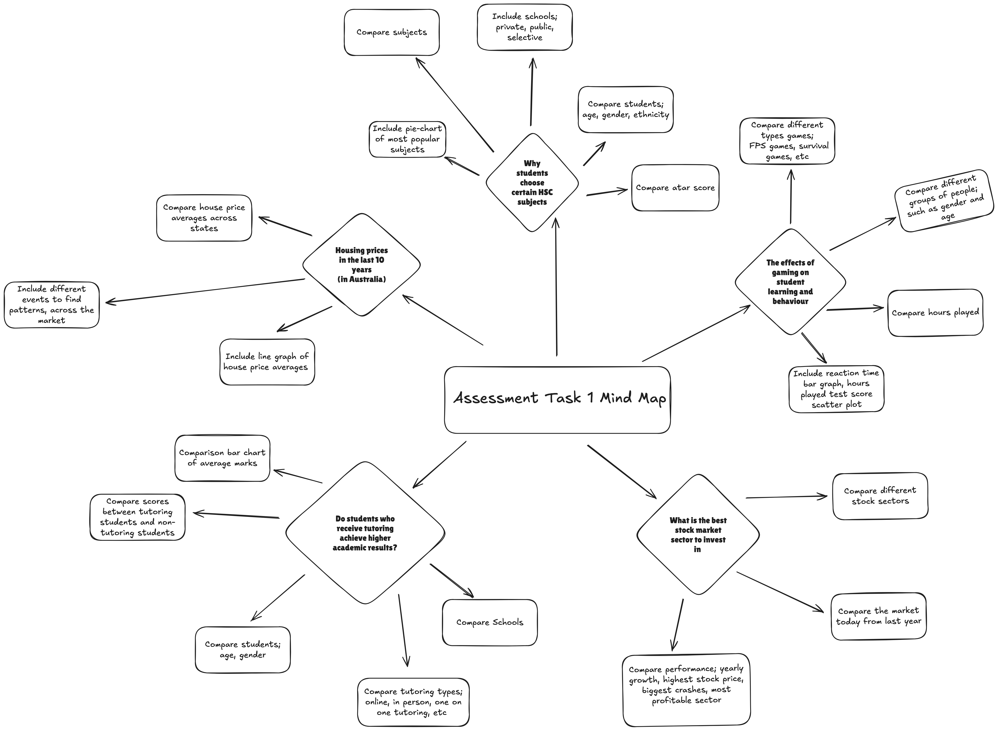

# **Assessment Task 1**

## **Phase 1 - Identifying and Defining**

### *Mind map*

### *Purpose* 
Hypothesis
“Students who spend more time gaming are more likely to have lower academic results.”

### *Requirements*

#### *Functional requirements*
The system must allow users to load and view a preloaded .csv dataset about gaming habits and academic performance. Users must be able to search or filter the dataset based on categories such as gaming hours, English improvement, or perceived impact on grades. The system must analyse the relationship between gaming time and academic results to help investigate the hypothesis that students who spend more time gaming are more likely to have lower academic results. It must generate visualisations such as bar charts and pie charts to display trends, comparisons, and patterns in the data. The program must also provide data summaries and research conclusions based on the analysed survey responses and display error messages if the user enters an invalid menu option.

#### *Non-functional requirements*
The system must be user-friendly and easy to navigate through a clear and organised interface. The user interface must include labelled menus, simple instructions, readable text, and consistent formatting so users can easily access the dataset, visualisations, and analysis tools. A README document must be included to explain the purpose of the program, how to run the system, how to use each feature, and how to troubleshoot common issues. The system must also be reliable by detecting errors such as invalid menu selections, missing files, or incorrect data formats and displaying clear error messages to the user. It must ensure data integrity by correctly loading and processing the dataset, preventing crashes during analysis, and ensuring that any data displayed or exported is accurate and consistent with the original dataset.

#### *Use Case*
Actor: User
Goal: To access and interact with existing gaming and English performance data through the program’s interface.
Preconditions:
The .csv dataset has already been preloaded into the system.
The user has access to the program interface.
The system has successfully loaded the dataset without errors.
Main Flow:
The user opens the program and is presented with a text-based menu.
The user selects one of the available options:
 a. View dataset preview
 b. View visualisation (charts and graphs of the dataset)
 c. Search or filter data using keywords
 d. View data summary (statistical overview of the dataset)
 e. View research conclusion (findings based on analysis)
The system performs the selected action.
The system outputs the requested data, analysis, or visualisation to the user.
Postconditions:
The user has successfully viewed or interacted with the dataset.
No changes are made to the dataset unless explicitly handled by a function.
The data remains available for further analysis, searching, and visualisation.

## **Phase 2 - Research and Planning**

### *Research*
There are many studies and articles discussing the relationship between gaming and academic performance. Some research suggests that excessive gaming can negatively affect school performance because students may spend less time studying or sleeping. Other studies argue that moderate gaming can improve skills such as problem-solving, reaction time, and teamwork.
Several news articles and education websites have discussed concerns about students spending long hours gaming, especially late at night, which may reduce concentration and homework completion. However, some students believe gaming helps them relax and reduce stress after school.

Sources:
Oxford Internet Institute – Gaming and Well-Being
https://www.oii.ox.ac.uk/news-events/news/video-gaming-can-be-good-for-your-mental-health-findings-from-a-large-scale-study/ 
American Psychological Association – Video Games and Cognitive Skills
 https://www.apa.org/monitor/2014/02/video-game
National Library of Medicine (PubMed) – Gaming Addiction and Academic Performance
 https://pmc.ncbi.nlm.nih.gov/articles/PMC6037427/
ScienceDirect – Online Gaming and Academic Achievement
 https://www.sciencedirect.com/science/article/pii/S0747563213000787 
The Conversation – Gaming and School Performance
https://theconversation.com/do-video-games-harm-childrens-education-heres-what-the-evidence-says-122633 
ABC News Australia – Screen Time and Students
https://www.abc.net.au/news/2023-10-11/screen-time-impact-on-children-learning-development/102956418 
Common Sense Media – Teens and Video Games
 https://www.commonsensemedia.org/articles/healthy-gaming-habits-for-teens 

### *Discussion*
Research into gaming and academic performance shows mixed findings about how gaming affects students. Some studies suggest that excessive gaming can negatively affect academic results because students may spend less time studying, sleeping, or completing homework. Research from PubMed and articles from ABC News Australia discuss how long gaming hours and increased screen time may reduce concentration and school performance. This supports the hypothesis that students who spend more time gaming are more likely to have lower academic results. In the collected survey data, students who reported gaming for longer periods were more likely to state that gaming negatively affected their grades or resulted in little academic improvement.
However, other research suggests that gaming does not always have negative effects on students. Studies from the Oxford Internet Institute and the American Psychological Association explain that moderate gaming may improve problem-solving, teamwork, and stress relief. Some students may use gaming as a way to relax after school, which could improve wellbeing and reduce stress levels. This suggests that gaming itself may not directly cause poor academic performance, and that other factors such as time management, sleep habits, and study routines may also influence results. Overall, the findings show that moderate gaming may have limited negative impact, while excessive gaming appears more strongly linked to lower academic performance.

### *Acquire data*
The data for this project was collected through a Google Forms survey created to investigate the relationship between gaming habits and academic performance. Participants answered questions about their gaming hours, English improvement, and whether they believed gaming affected their grades. 
Survey Link:
 https://docs.google.com/spreadsheets/d/1s1HmXkDKfTVtlYArIlFzf7CWeCgT-Yivz8kXy46GtKA/edit?usp=sharing

### *Planning*
Field|Datatype|Format for Display|Description|Example|Validation|
|-|-|-|-|-|-|
|Gaming Hours|str|X-X Hours or X+|Number of hours students spend gaming on average in a week|8 hours +|Must contain a valid gaming hour category and cannot be left blank.
|English Improvement|str|XX...XX|Describes how the student believes their English performance has changed|I’ve slightly improved|Must match one of the survey response options.|
|Perceived Impact on Grades|str|Yes/No|Indicates whether the student believes gaming has affected their academic grades.|Yes|Must only contain “Yes” or “No”.|

## **Phase 3 - Producing and Implementing**

Read the README to find out how the program works.

### *Python, Pandas, Matplotlib

### *User Interface*

## **Phase 4 - Testing and Evaluating**

### *Analyse and conclude*
The survey results showed that students who spent excessive amounts of time gaming were more likely to experience lower English improvement results. Students who gamed for 8 or more hours often reported responses such as “I have not improved” or “I performed slightly worse,” while students who gamed for fewer hours more commonly reported slight or significant improvement in their English marks. This suggests that high gaming hours may negatively influence academic performance because students may spend less time studying or focusing on schoolwork. For example, several students in the “8 hours +” category stated that gaming affected their grades and also reported little or no academic improvement, while many students in the “1–4 hours” categories reported positive improvement in English. These findings support the hypothesis that excessive gaming can negatively impact English performance, although the data also showed that moderate gaming does not always lead to poor academic grades,suggesting that other factors such as study habits,time management,and personal discipline may also influence student performance. This suggests that there is a correlation between gaming hours and English performance, but the data does not directly prove any causation that gaming affected the academic results of GHS students.

### *Peer Verification*
Exchange your work with a classmate. Verify each other's datasets, calculations, and outputs. Provide feedback – PMI tables are helpful here (Plus, Minus, Implication).
For Plus, outline any positive aspects / what works.
For Minus, outline any negative aspects / what does not work.
For Implication, you need to go deeper and evaluate the impact of what the plus and minuses mean for the project (i.e. make a judgement and determine what action is needed, or what the impact of the plus and minus is).

### *Evaluate your project*
Evaluate your system and results in relation to your Requirements Outline.
Evaluate your system in relation to peer feedback.
Evaluate your project in relation to project management.
Evaluate your system in in relation to its data and security. 
Is the data valid, accurate and timely? 
Is it unbiased? 
Do we need to improve its security – if so, how? 
Could the UX be more accessible – if so, how?